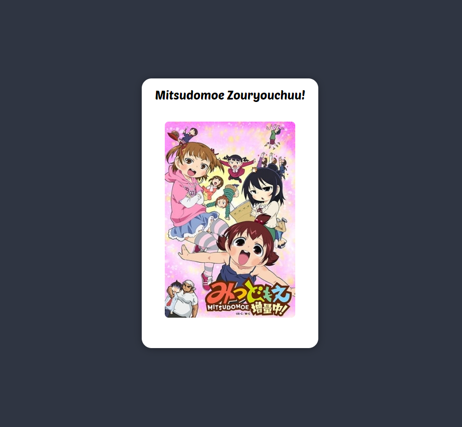

# Anime-card
an card which display name of anime and its poster.<br>
its uses an api for data and displays its on html.
```js
document.addEventListener('DOMContentLoaded', function () {
  fetch('https://random-api.xyz/api/anime/random')
    .then(response => response.json())
    .then(data => {
      const apiDataElement = document.getElementById('apiData');
      const apimediaElement = document.getElementById('apimedia');
      apiDataElement.textContent = data.results[0].title;
      apimediaElement.src = data.results[0].poster;
      console.log(data);
    })
    .catch(error => {
      console.error('Error fetching API data:', error);
    });
});
```


## Inventory 
API used in app - [Random-api](https://docs.random-api.xyz)

Fonts - [Google Fonts](https://fonts.google.com/share?selection.family=Poetsen+One)

## Preview
</img>
